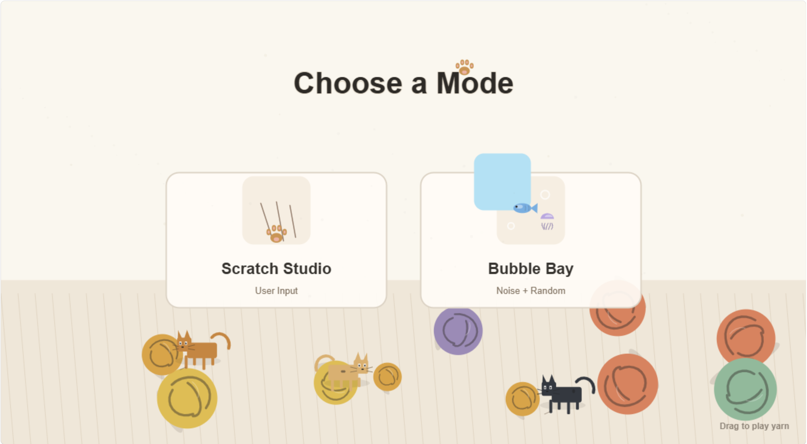
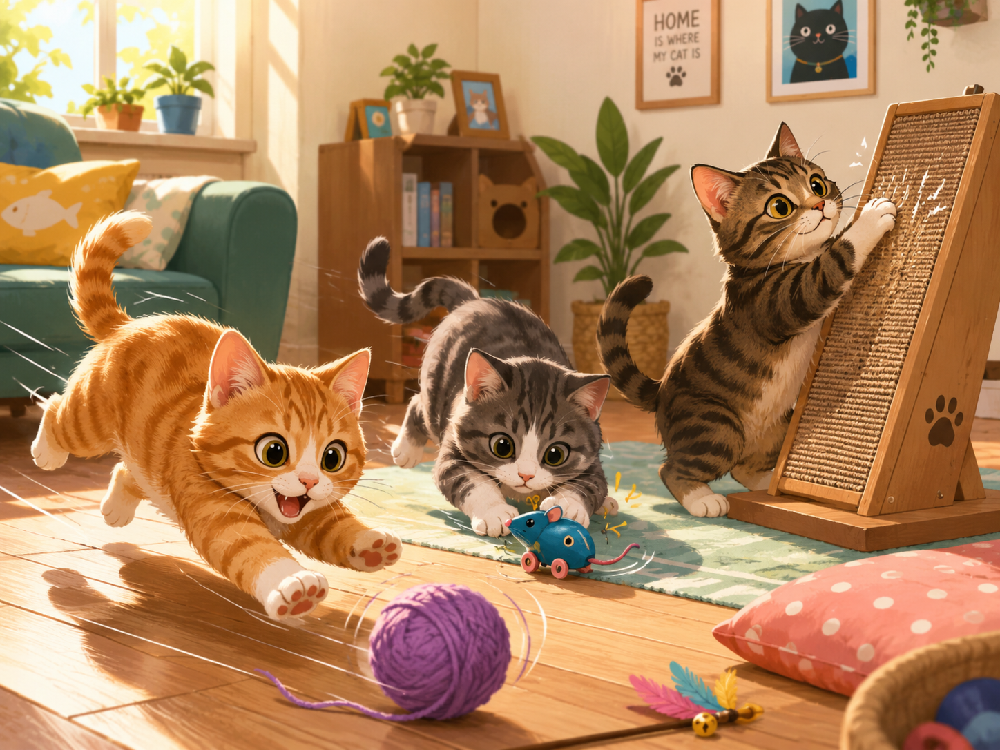
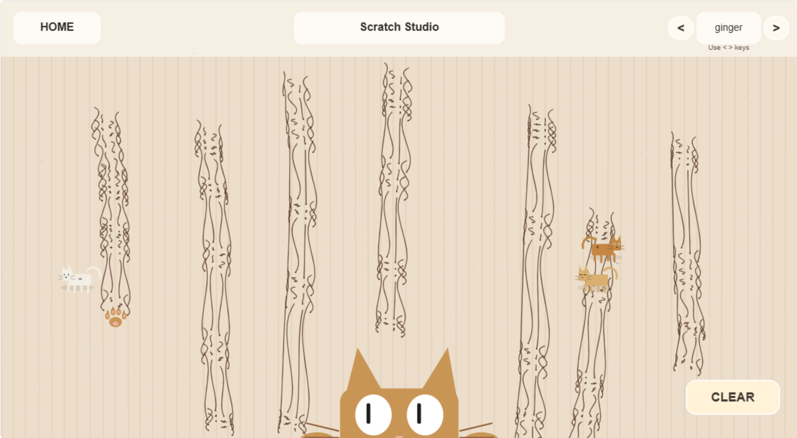
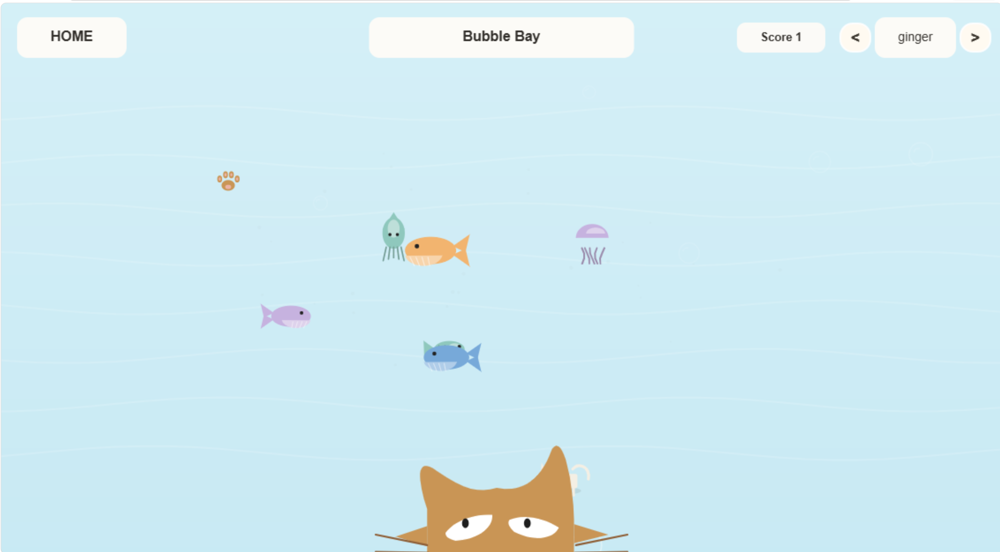

# PAWPLAY

## IDEA9103 Creative Coding Final Project

**Chosen option:** Create an original piece.

PAWPLAY is a small p5.js play space about cats, scratching, yarn, and soft target chasing. The project has one home screen and two modes: **Scratch Studio** and **Bubble Bay**.

---

## Inspiration

Our team was inspired by everyday cat play: cats chase rolling yarn, scratch textured boards, follow small moving objects, and react to visual motion. We wanted the interface to feel like a gentle pet-play room rather than a competitive game.

The image below inspired the warm room mood, playful cat movement, scratch-board action, and yarn-chasing theme.

The final screens translate those inspirations into three clear play states.

| Home | Scratch Studio | Bubble Bay |
| --- | --- | --- |
|  |  |  |

---

## Techniques

### State-Based Navigation

The project uses a `gameState` variable to switch between `home`, `scratch`, and `bubble`. This keeps each screen separate while still sharing the same canvas, colour palette, and input system.

### Time-Based Motion

`frameCount`, timed delays, and sine motion control the rolling yarn, walking cats, blinking cats, and reward timing. These time-based systems keep the scene alive even when the user is not clicking.

### User Input

Mouse input is used for page navigation, dragging yarn balls, drawing scratch marks, clearing the scratch board, clicking sea animals, closing the popup, and changing paw colour. Keyboard arrow keys also change the paw and cat colour in the final version.

### Perlin Noise and Randomness

Random values vary size, colour, position, speed, and spawn timing. Perlin noise creates smooth underwater movement for sea animals so Bubble Bay feels softer and less mechanical than straight-line motion.

### Classes and Arrays

The code uses arrays and classes for yarn balls, timed cats, scratch marks, debris, sea animals, bubbles, and pop effects. Each object updates and draws itself every frame, which makes the project easier to extend across the seven build steps.

---

## Code Structure

The final project uses modular JavaScript files so each mechanic has a clear owner and purpose. The `scripts` folder contains exactly three mechanic files, one for each team member.

| File | Responsibility |
| --- | --- |
| `sketch.js` | Main p5 setup, shared state, preload, draw loop, and responsive canvas resizing. It brings the three mechanic scripts together. |
| `scripts/01_Time-based.js` | Time-based rolling yarn, walking cats, blinking cats, and timed scene motion. |
| `scripts/02_User input.js` | Mouse and keyboard controls, page navigation, scratch drawing, yarn dragging, scoring clicks, and modal buttons. |
| `scripts/03_Perlin noise.js` | Perlin-noise sea creatures, bubbles, random scratch debris, and subtle background details. |

Each team member owns one mechanic from start to finish. Functions and classes keep the code readable, and `windowResized()` rebuilds layout positions so the project scales with the browser window.

---

## Mechanic Ownership

| Team member | Mechanic | Description |
| --- | --- | --- |
| Sylvie Chen | Time-based | Built the home scene timing, edge-to-edge yarn rolling, walking cats, blinking cats, and 10-point reward timing. |
| Fanfei Li | User input | Built mode navigation, Scratch Studio dragging, yarn dragging and kicking, Bubble Bay scoring clicks, colour controls, modal buttons, and mouse-follow eyes. |
| Wenjia Jiang | Perlin noise and randomness | Built drifting sea creatures, rising bubbles, scratch debris, subtle background particles, and quiet random details. |

---

## Interaction Instructions

1. Open the final project folder and run `index.html` in a browser.
2. On the home screen, watch yarn balls roll from one side to the other.
3. Drag a yarn ball and release it to kick it; only the selected ball is affected.
4. Click **Scratch Studio** to enter the scratch-board mode.
5. Press and drag to draw scratch marks. Press `CLEAR` to reset the board.
6. Click **Bubble Bay** to enter the underwater mode.
7. Click sea creatures to score points.
8. Every 10 points opens a reward popup.
9. Use `<`, `>`, or keyboard arrow keys to change paw and cat colour in the final version.
10. Use `HOME` to return to the main screen.

---

## External References

### Page Switching Tutorial

https://www.youtube.com/watch?v=IWyPwbt5ZrA

This video influenced the page-switching logic. In PAWPLAY, the idea is adapted into a p5.js `gameState` variable, so clicking the mode cards changes between `home`, `scratch`, and `bubble` inside one canvas.

### MDN HTML Dialog Element

https://developer.mozilla.org/en-US/docs/Web/HTML/Reference/Elements/dialog

This reference influenced the popup interaction pattern. The project uses the same logic idea: a popup appears above the scene, blocks background interaction, and can be closed with buttons. PAWPLAY draws this modal directly in p5.js instead of using the HTML `<dialog>` element.

### p5.js Aim Example

https://p5js.org/examples/angles-and-motion-aim/

Used as a reference for the idea of mouse-directed eye movement. The final cat eyes use constrained offsets so the pupils stay inside the eye shapes.

---

## AI Acknowledgement

We used ChatGPT to organise code structure, debug p5.js state flow, and refine README wording. The team reviewed, tested, and adjusted all AI-supported work to match the project goals.

We also used AI image generation to create the cat playroom inspiration image shown above.

---

## GitHub Link

[fali0101/-Jared-Final-Project-Team----4.git](https://github.com/fali0101/-Jared-Final-Project-Team----4.git)
